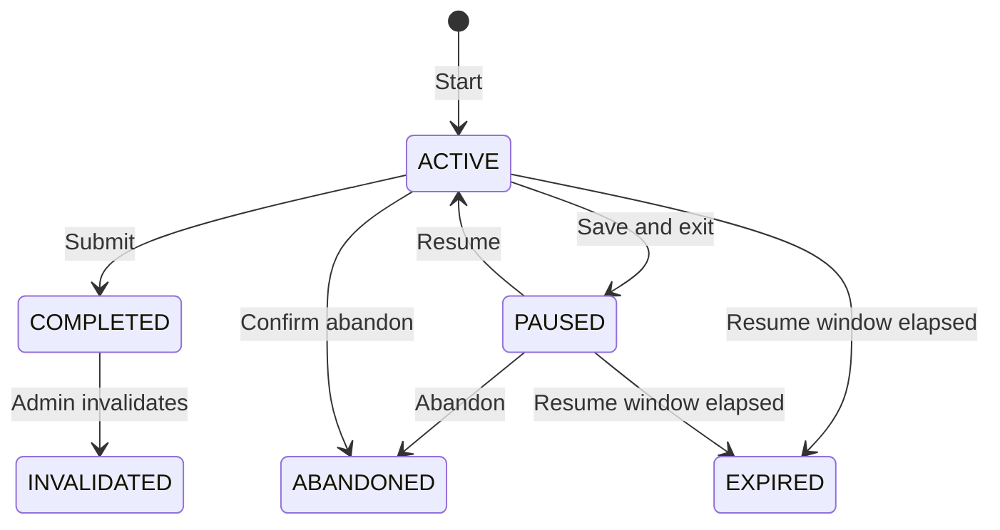

# User, Session Lifecycle, History, and Admin Design

## Decision summary

1. Clicking the session exit button must never silently delete or abandon an
   attempt.
2. Show an exit dialog with:
   - **Continue exam**
   - **Save and exit** — checkpoint and mark the session `PAUSED`
   - **Abandon attempt** — second confirmation, then mark it `ABANDONED`
3. Completed attempts are immutable records. Admins may annotate, invalidate,
   rescore, or delete them only through audited operations.
4. Performance aggregates should be updated from an idempotent completion
   event, not an untracked best-effort function call.
5. Keep session summaries much longer than detailed question interactions.
   Retention limits belong in an admin-managed policy.
6. Add a dedicated admin user directory and student detail workspace before
   adding moderation mutations.

## Current behavior

### Session lifecycle

`TestSession` currently has no explicit status. An open session is inferred from
`endTime = null`; a completed session gets `endTime` and `completedAt`.

Consequences:

- exit, pause, crash, timeout, and abandonment are indistinguishable;
- stale sessions remain open indefinitely;
- there is no safe resume/abandon contract;
- deleting a session also requires manually deleting dependent interactions and
  activity logs because those relations do not cascade.

### Profile and performance updates

There is no cron job.

- Identity/profile fields are synchronized on the Supabase callback.
- Name, institution, region, and target exams change through onboarding or
  Settings.
- `UserStats` and `UserExamStats` update after every successful exam
  submission.
- That update currently happens inline after session completion and QStash
  publication.
- Failures are logged and swallowed, so a completed session can exist while the
  profile aggregates remain stale.
- JSON accuracy maps are read, changed in memory, and written back. Concurrent
  completions can overwrite each other.
- Several scalar fields on `User` duplicate `UserStats` concepts and are not
  consistently maintained.

### History and admin

- The overview shows three recent completed sessions.
- Exam detail currently loads every completed session and all of its
  interactions for that exam.
- There is no history retention policy or archive process.
- There is no admin student directory or student detail page.
- The existing account menu only links admins to the content library.
- Admin authorization is a single `role === ADMIN` check.
- There is no admin audit log, ban/pause state, or safe history-correction
  workflow.

## Proposed lifecycle

Add a `SessionStatus` enum:

- `ACTIVE`
- `PAUSED`
- `COMPLETED`
- `ABANDONED`
- `EXPIRED`
- `INVALIDATED`

Add to `TestSession`:

- `status`
- `updatedAt`
- `lastCheckpointAt`
- `pausedAt`
- `abandonedAt`
- `abandonReason`
- `expiresAt`
- `invalidatedAt`
- `invalidatedById`
- `invalidationReason`
- `statsProcessedAt`

Recommended indexes:

- `(userId, status, startTime)`
- `(status, expiresAt)`
- `(paperId, status)`
- `(userId, completedAt)`

Add cascading deletion from `TestSession` to `QuestionInteraction` and
`ActivityLog` only after confirming all deletion paths are audited.

## Exit behavior

The X button opens a dialog instead of navigating immediately.

### Save and exit

1. Flush the latest checkpoint.
2. Call an authenticated `pauseSession(sessionId)` action.
3. Verify ownership and `ACTIVE` status.
4. Set `PAUSED`, `pausedAt`, `lastCheckpointAt`, and `updatedAt`.
5. Navigate to `/library/paper`.

The paper card should show **Resume** when a resumable session exists. Starting
the same paper should reuse that session instead of creating another row.

### Abandon attempt

1. Require a second confirmation because this affects history.
2. Flush the checkpoint.
3. Set `ABANDONED` and `abandonedAt`.
4. Do not update scores, streaks, mastery, or performance aggregates.
5. Keep the record until the abandoned-session retention window expires.

Deleting immediately is not recommended: it destroys support/audit evidence and
makes accidental exits impossible to investigate.

## Durable profile and statistics updates

Submission should use a database transaction to:

1. finalize the authoritative session result;
2. set `status = COMPLETED`;
3. create a unique `SESSION_COMPLETED` outbox event.

A worker consumes the event and updates normalized aggregates idempotently. A
unique processed-event/session contribution prevents double counting.

Recommended models:

- `OutboxEvent`
- `SessionStatContribution` — one row per completed session
- normalized per-user/type/difficulty/subject aggregates, or a controlled
  materialized summary

`UserStats` remains a fast read model. It can be rebuilt from valid completed
session contributions. Admin invalidation or rescoring updates the contribution
and rebuilds the affected user/exam summary.

Cron is useful for maintenance, not normal profile updates:

- expire stale `ACTIVE`/`PAUSED` sessions;
- enforce retention;
- retry failed outbox events;
- detect/rebuild aggregate drift.

## Retention design

Do not enforce one hard maximum for all session data. Use tiered retention:

| Data | Suggested default | Action |
|---|---:|---|
| Completed session summary | Indefinite or 3 years | Keep compact score/timing row |
| Detailed completed interactions | 365 days, minimum latest 100 attempts | Archive or purge details |
| Abandoned/expired interactions | 30 days | Purge detail |
| Abandoned/expired session summary | 90 days | Purge or anonymize |
| Admin audit records | 3–7 years | Append-only retention |
| Outbox events | 30–90 days after success | Purge processed events |

Create a singleton `RetentionPolicy` record with:

- `completedDetailDays`
- `completedDetailMinimumAttempts`
- `abandonedDetailDays`
- `abandonedSummaryDays`
- `resumeWindowHours`
- `auditDays`
- `updatedById`
- `updatedAt`
- `version`

The admin settings page validates bounded values and records every policy
change in `AdminAuditLog`.

## Admin user management

### Routes

- `/admin/users`
- `/admin/users/[userId]`
- `/admin/settings/retention`
- `/admin/audit`

### User directory

Search/filter by:

- name/email;
- account status;
- role;
- plan/access;
- target exam;
- last active date;
- registration date.

Each row gets an actions menu, but high-impact operations require a reason and
confirmation.

### Student workspace tabs

1. **Overview** — profile, access, usage, account status.
2. **Attempts** — paginated sessions with status, score, mode, and paper.
3. **Performance** — read-model aggregates and contribution health.
4. **Purchases** — paid access and expiry.
5. **Admin notes/audit** — append-only operator history.

### Account states

Add `UserStatus`:

- `ACTIVE`
- `PAUSED`
- `BANNED`

Add:

- `statusReason`
- `statusUntil`
- `statusChangedAt`
- `statusChangedById`

Semantics:

- `PAUSED`: sign-in and read-only history allowed; new sessions and purchases
  blocked.
- `BANNED`: protected application access blocked.
- Avoid hard-deleting users from routine admin UI.

Authorization must enforce status on the server in the shared auth/session
boundary, not only by hiding buttons.

## History administration

Admins should not directly edit completed database rows.

Allowed audited commands:

- annotate an attempt;
- invalidate/reinstate an attempt;
- request a rescore;
- correct a score through a versioned adjustment;
- delete/anonymize for an approved privacy or retention reason.

Add `SessionAdjustment` and `AdminAuditLog` records containing actor, target,
reason, before/after values, timestamp, and request correlation ID.

## Authorization

The current `ADMIN` check is too coarse for student management.

Initial permissions:

- `users.read`
- `users.moderate`
- `users.roles.manage`
- `sessions.read`
- `sessions.adjust`
- `sessions.delete`
- `settings.retention.manage`
- `audit.read`

Map roles to permissions in server code initially:

- `SUPER_ADMIN`
- `ADMIN`
- `SUPPORT`
- `CONTENT_MANAGER`

Every page, action, and API route must check the required permission.

## Delivery plan

### Phase 1 — session lifecycle

- schema migration and indexes;
- pause/abandon/resume actions;
- exit dialog;
- Resume state on paper cards;
- lazy expiry checks;
- tests for ownership and status transitions.

### Phase 2 — reliable statistics

- transactional outbox;
- idempotent session contributions;
- aggregate rebuild command;
- remove duplicate/stale `User` performance fields;
- tests for retries, invalidation, and concurrent completion.

### Phase 3 — read-only admin users

- permission boundary;
- searchable/paginated user directory;
- student overview, attempts, performance, and purchases;
- query indexes and bounded reads.

### Phase 4 — moderation and history controls

- user pause/ban/reactivate;
- session annotate/invalidate/rescore;
- append-only audit log;
- cache/session revocation behavior.

### Phase 5 — retention configuration

- retention policy admin page;
- scheduled expiry/pruning worker;
- dry-run report and export;
- batched deletion with audit and monitoring.

Do not start Phase 4 or 5 before audit logging, permissions, and idempotent
statistics are in place.
